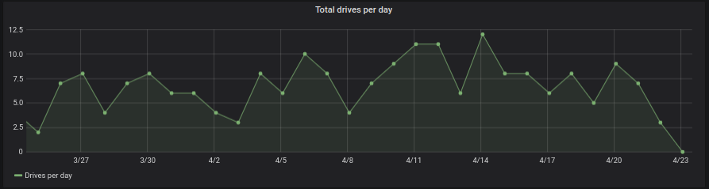
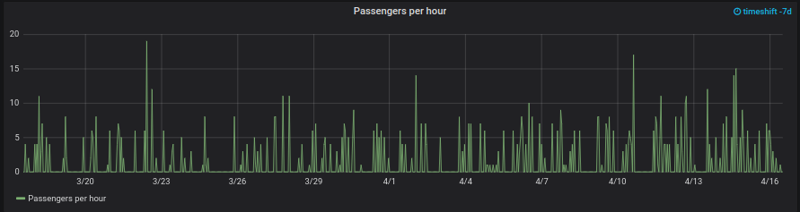
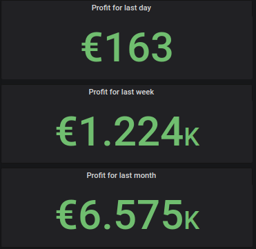
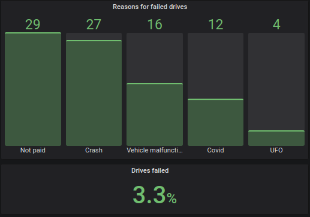
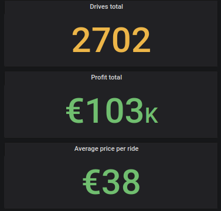
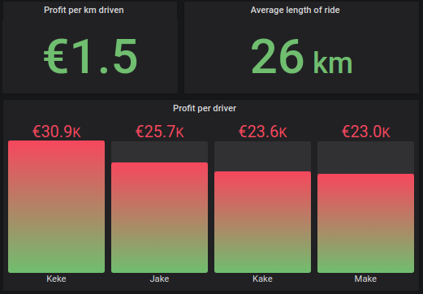
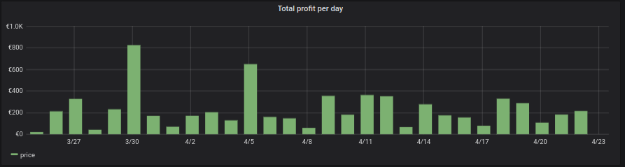
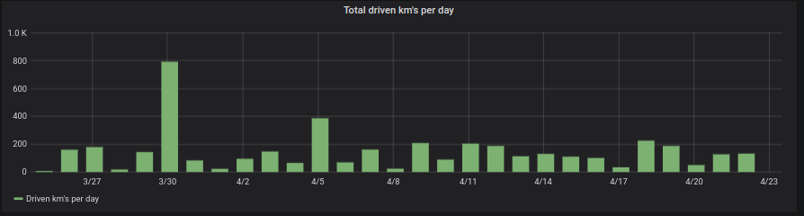

# Panels and related queries in taxi dashboard

## Introduction

In this document you have all the panels and related queries present in taxi dashboard. JSON_file of dashboard can be found [here](https://github.com/Robo-Project/rpa_dashboard_grafana/blob/master/dashboards/taxi_board.json).

Default timeshift is 30 days. Total passengers per hour uses timeshift of 7 days.

## Panels and queries

### Total drives per day



```
SELECT
  $__timeGroup(start_time, '1d', 0),
  count(xml_hash) as "Drives per day"
FROM taxi_drives
WHERE
  $__timeFilter(start_time)
GROUP BY time
ORDER BY time
```

Format as timeseries

### Passengers per hour (timeshift 7d)



```
SELECT
  $__timeGroup(start_time, '1h', 0), 
  sum(passengers) as "Passengers per hour"
FROM taxi_drives 
WHERE $__timeFilter(start_time)
GROUP BY time
ORDER BY time
```

Note: below query set time shift to "7d", format as timeseries

### Profit for last day, week and month



```
SELECT 
SUM(price) AS "price"
FROM taxi_drives    
WHERE start_time >= (now() - interval '1 days')
GROUP BY taxi_drives.start_time

SELECT 
SUM(price) AS "price"
FROM taxi_drives    
WHERE start_time >= (now() - interval '7 days')
GROUP BY taxi_drives.start_time

SELECT 
SUM(price) AS "price"
FROM taxi_drives    
WHERE start_time >= (now() - interval '30 days')
GROUP BY taxi_drives.start_time
```

Format as table

### Reasons for failed drives and total drives failed



```
SELECT
reason_for_failure,
  count(reason_for_failure)
FROM taxi_drives
WHERE
  trip_succeeded = false
GROUP BY reason_for_failure
ORDER BY -count(reason_for_failure)

Select 
   Count(CASE WHEN trip_succeeded=false  THEN 0 END) *100.0 / ((Select Count(car_number) From taxi_drives) * 1.00)
From taxi_drives

```

Format as table

### Total drives, Total profit and Average price per ride



```
SELECT
  count(car_number)
FROM taxi_drives

SELECT
  SUM(price) AS price
FROM taxi_drives

SELECT
  avg(price) AS "price"
FROM taxi_drives
```

Format as table

### Profit per km driven, Average length of ride and Profit per driver



```
SELECT
  SUM(price) / SUM(length_of_drive)
FROM taxi_drives

SELECT
  avg(length_of_drive) AS "length"
FROM taxi_drives

SELECT
  driver,
  sum(price)
FROM taxi_drives
GROUP BY driver
ORDER BY -sum(price)
```

Format as table

### Total profit per day



```
SELECT
  $__timeGroup(start_time, '1d', 0), 
  sum(price) as price
FROM taxi_drives 
WHERE $__timeFilter(start_time)
GROUP BY time
ORDER BY time
```

Format as timeseries

### Total driven km's per day



```
SELECT
  $__timeGroup(start_time, '1d', 0),
  sum(length_of_drive) as "Driven km's per day"
FROM taxi_drives
WHERE
  $__timeFilter(start_time)
GROUP BY time
ORDER BY time
```

Format as timeseries
